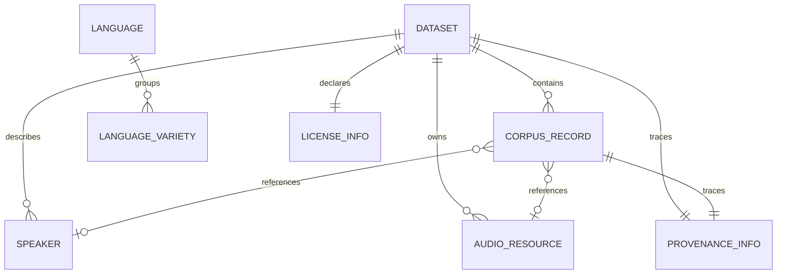

# Modelo canónico de datos

## Propósito

Los corpus llegan desde fuentes con estructuras, granularidad y niveles de documentación diferentes. El modelo canónico ofrece un contrato común para integrarlos sin alterar el original ni presentar información desconocida como si estuviera confirmada. No reemplaza el formato fuente: constituye una representación derivada y trazable.

## Dataset y CorpusRecord

`Dataset` describe la colección: idiomas, variedades declaradas, alcance geográfico, modalidades, usos potenciales, licencia, procedencia y conteos agregados. `CorpusRecord` describe una unidad individual de texto y sus vínculos opcionales con traducción, audio y hablante.

Esta separación evita repetir metadata global en cada registro y evita inferir propiedades del registro a partir de otros corpus. Un registro conserva obligatoriamente `dataset_id` y `source_record_id`.

Las líneas expresan referencias del contrato, no tablas ni decisiones de persistencia.

## Trazabilidad y procedencia

`ProvenanceInfo` conserva el nombre y URL de la fuente, organización, identificador original del dataset, cita, fecha de recuperación y notas. Es obligatoria como estructura en `Dataset` y `CorpusRecord`, aunque sus campos puedan ser `null`. Esto permite distinguir “se revisó y es desconocido” de la ausencia accidental del bloque de procedencia.

Cada `CorpusRecord` exige:

- `dataset_id`: vínculo con la metadata canónica de la colección;
- `source_record_id`: identificador sin reemplazar de la fuente;
- `provenance`: contexto explícito del origen.

## Licencia

`LicenseInfo` es obligatoria como estructura del dataset. Sus permisos (`commercial_use`, `redistribution`, `derivatives` y `attribution_required`) admiten `true`, `false` o `null`. `null` significa desconocido y nunca concede permisos implícitamente.

## Idiomas y variedades

`Language` conserva el nombre y, cuando está disponible, el código ISO declarado. No existe una enumeración limitada a Quechua y Aymara. `LanguageVariety` mantiene un identificador, nombre y, cuando estén disponibles, región, país, glottocode y metadata fuente-específica. El modelo no asigna códigos ni unifica variedades automáticamente.

## Valores desconocidos y extensibilidad

Los campos no esenciales admiten `null`. Una lista `null` significa que no se conoce la información; una lista vacía significa que la fuente confirma que no hay elementos. `metadata` permite conservar información adicional suministrada por la fuente sin inventar campos normalizados ni imponer datos demográficos.

Las modalidades, tareas y dominios son cadenas abiertas. Valores como `text`, `audio` o `machine_translation` son convenciones posibles, no un catálogo cerrado.

## Relación con los archivos originales

Los archivos bajo `data/raw/` permanecen intactos. En iteraciones futuras, cada adaptador convertirá una fuente al contrato canónico y documentará la transformación. Los modelos Pydantic viven en `backend/app/schemas/canonical.py`; los contratos portables equivalentes están en `datasets/schemas/`.
