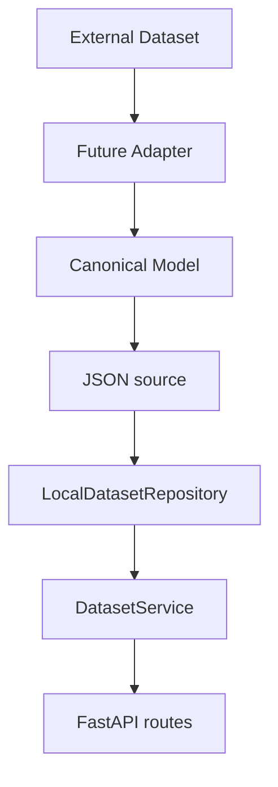

# Dataset Registry

## Propósito

Dataset Registry permite descubrir colecciones lingüísticas y consultar sus registros mediante un contrato uniforme. Resuelve la necesidad inicial de abrir archivos manualmente y comprender formatos distintos antes de saber qué contiene una colección.

Esta versión lee JSON desde `data/samples/` y manifiestos catalogados desde `datasets/registry/`, valida su contenido con los modelos Pydantic canónicos y lo expone mediante FastAPI. No utiliza PostgreSQL.

## Flujo

`canonical-development-sample.json` funciona como fuente canónica con registros. Los manifiestos puros del Registry, como Common Voice Puno Quechua, pueden describir recursos externos sin contener registros ni requerir que el corpus esté descargado.

## Responsabilidades

### Repository

`LocalDatasetRepository` conoce el almacenamiento JSON. Descubre tanto sobres con `dataset` y `records` como manifiestos `Dataset` puros, valida los modelos canónicos, comprueba que los registros pertenezcan al dataset declarado y transforma fallos de lectura en errores controlados. No conoce HTTP, filtros de negocio ni paginación.

Su contrato mínimo ofrece:

- `list_datasets()`;
- `get_dataset(dataset_id)`;
- `list_records(dataset_id)`.

### Service

`DatasetService` coordina consultas independientes del almacenamiento. Aplica filtros exactos sin distinguir mayúsculas, filtra registros y realiza paginación con `limit` y `offset`. Solo depende del contrato `DatasetRepository`.

### Routes

Las rutas traducen HTTP a llamadas del servicio, validan parámetros de consulta y convierten errores del repositorio en respuestas controladas. No abren archivos.

Los endpoints son:

- `GET /api/v1/datasets`;
- `GET /api/v1/datasets/{dataset_id}`;
- `GET /api/v1/datasets/{dataset_id}/records`.

## Sustitución futura por PostgreSQL

Una implementación futura podrá cumplir el mismo contrato `DatasetRepository` usando PostgreSQL. La configuración de dependencias seleccionará esa implementación; `DatasetService` y las rutas no necesitarán conocer consultas SQL ni cambiar sus casos de uso.

## Adaptadores futuros

`ml/ingestion/base_adapter.py` define `load_metadata()` y `load_records()`. `CommonVoiceAdapter` es la primera implementación: lee TSV montados localmente, conserva procedencia e identificadores originales y produce modelos canónicos sin descargar ni copiar audio. Adaptadores posteriores podrán alimentar JSON u otro repositorio sin acoplar el formato externo a la API.

## Catálogo y disponibilidad

El catálogo integra Common Voice (audio/texto para ASR) y AmericasNLP 2021
(texto paralelo para traducción). `AmericasNLPAdapter` implementa el mismo
contrato de ingestión y conserva los pares `aym`/`es`, splits y procedencia.
Su manifiesto es descubierto automáticamente en `datasets/registry/aymara/`.
Véase [formato, licencia y comparación de proveedores](../datasets/americasnlp-aymara-spanish.md).

Catalogar no implica alojar. Un manifiesto puede declarar `metadata.cataloged: true` y `metadata.available_locally: false`. Así el Registry informa que el recurso existe, dónde se obtiene y bajo qué condiciones, mientras `list_records()` devuelve una lista vacía hasta que una etapa de ingestión explícita produzca registros accesibles al repositorio.

## Errores

Un dataset inexistente devuelve `404`. Una ruta local inexistente o un JSON inválido produce un error controlado del repositorio y la API responde con un mensaje genérico, sin exponer rutas internas ni stack traces.
