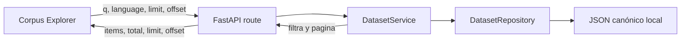

# Corpus Explorer

## Propósito

Corpus Explorer permite leer registros de un dataset desde el navegador sin descargar archivos ni escribir código. La interfaz actual ofrece exploración textual tradicional y no modifica el corpus original. La búsqueda semántica existe como endpoint backend separado; su interfaz se implementará en una iteración posterior.

## Flujo

La ruta `GET /api/v1/datasets/{dataset_id}/records` devuelve una página con `items`, `total`, `limit` y `offset`. El parámetro opcional `q` se compara sin distinguir mayúsculas sobre `text` y `translation`. Los filtros se aplican antes de paginar y no alteran los registros.

## Disponibilidad

Un dataset puede estar catalogado aunque su corpus no esté instalado. Para un identificador existente sin registros locales, la API devuelve una página vacía con `total: 0`; no devuelve 404. El frontend usa `metadata.available_locally` para explicar si hay que obtener el recurso desde la fuente oficial. Un identificador inexistente sí produce 404.

La muestra sintética de desarrollo permite verificar texto, traducción y referencia de audio sin presentar contenido inventado como Quechua o Aymara real. Los corpus reales no se incluyen en Git.

## Interfaz

Cada ficha conserva `dataset_id`, `source_record_id`, idioma, variedad, traducción, split, procedencia y referencia de audio cuando existen. El audio solamente se señala; no hay reproducción ni streaming. La búsqueda se ejecuta en el backend al enviar el formulario. La navegación usa paginación por desplazamiento con botones Anterior y Siguiente.

## Limitaciones y evolución

La búsqueda de esta interfaz sigue siendo una coincidencia de subcadena en memoria. No incorpora ranking semántico, corrección ortográfica ni PostgreSQL. El motor semántico local y su endpoint conservan los mismos conceptos canónicos y trazabilidad, pero todavía no están conectados a la interfaz.
